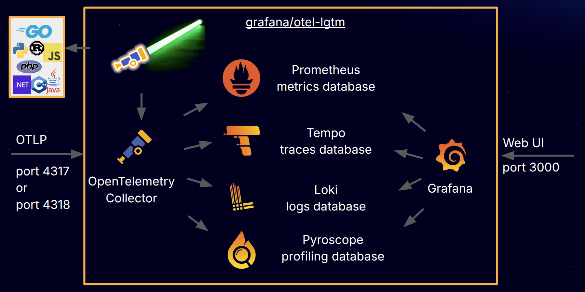

### 📊 Prometheus
* Purpose: Metrics collection and storage.
* How it works: Prometheus scrapes metrics endpoints (usually /metrics in Prometheus format) from applications or exporters.
* Visualization: Often paired with Grafana for dashboards.
* Scope: Metrics only (CPU, memory, request counts, latencies, etc.).

### 🌐 OpenTelemetry (OTel)
* Purpose: A standardized framework for generating and exporting traces, metrics, and logs.
* How it works: Applications instrumented with OTel SDKs produce telemetry data. The OpenTelemetry Collector receives this data and forwards it to backends (Jaeger, Prometheus, Grafana, Datadog, etc.).
* Scope: Traces, metrics, and logs — not just traces.


## PROJECT SETUP
1. Prometheus is a backend for metrics.
2. OpenTelemetry is a pipeline for telemetry data (traces, metrics, logs).
3. You can configure the OpenTelemetry Collector to DO IT THROUGH PROFILING:
4. Send traces → Jaeger.
5. Send metrics → Prometheus.
6. Send logs → ELK stack or another backend.


### ✅ Example in Your Setup
1. Spring Boot apps (via Micrometer + OpenTelemetry) generate metrics and traces.
2. Traces go through the OTel Collector → Jaeger → Jaeger UI.
3. Metrics go through the OTel Collector → Prometheus → Grafana dashboards.


### 🚀 Key Takeaway
1. Prometheus = metrics database + scraper.
2. OpenTelemetry = unified standard for traces, metrics, logs.
3. They complement each other: OTel generates/collects, Prometheus stores/visualizes metrics, Jaeger stores/visualizes traces.

### **Prerequisites ::**
#### **The LGTM stack is Grafana Labs' open-source observability stack. The acronym stands for::**
1. [x] Loki — for logs (log aggregation system)
2. [x] Grafana — for visualization and dashboards
3. [x] Tempo — for traces (distributed tracing backend)
4. [x] Mimir — for metrics (long-term storage for Prometheus metrics)

#### WHEN WE ADD DOCKER-COMPOSE MAVEN DEPENDENCY THEN AUTOMATICALLY THIS WILL GENERATE THIS STACK FOR OBSERVABILITY
```yaml
services:
  grafana-lgtm:
    image: 'grafana/otel-lgtm:latest'
    ports:
      - '3000:3000'
      - '4317'
      - '4318'

```

### Exporting Logs via OTLP
This demo is configured to export logs to Grafana/Loki via OTLP. This allows you to view, search, and correlate logs with traces directly in Grafana.

Spring Boot 4.0.1 or later is required for OTLP logging export without the actuator module.

Spring Boot provides auto-configuration for exporting logs in OTLP format, but does not install an appender into Logback by default. To enable log export, you need:
1. Add the Logback Appender Dependency
```xml
<dependency>
    <groupId>io.opentelemetry.instrumentation</groupId>
    <artifactId>opentelemetry-logback-appender-1.0</artifactId>
    <version>2.25.0-alpha</version>
    <scope>runtime</scope>
</dependency>
```
Note: The -alpha suffix indicates this is still marked as unstable by the OpenTelemetry project. There are currently no stable (non-alpha) versions of this appender.

2. Create logback-spring.xml
3. Create src/main/resources/logback-spring.xml to add the OpenTelemetry appender:
```xml
<?xml version="1.0" encoding="UTF-8"?>
<configuration>
    <include resource="org/springframework/boot/logging/logback/base.xml"/>

    <appender name="OTEL" class="io.opentelemetry.instrumentation.logback.appender.v1_0.OpenTelemetryAppender">
    </appender>

    <root level="INFO">
        <appender-ref ref="CONSOLE"/>
        <appender-ref ref="OTEL"/>
    </root>
</configuration>
```
This configuration:
* Imports the default Spring Boot logging configuration
* Adds an OpenTelemetry appender that sends logs to the OpenTelemetry SDK
* Attaches both the console and OTEL appenders to the root logger

3. Create the Appender Installation Bean
The OpenTelemetry appender needs to know which OpenTelemetry instance to use. Create this component:
```java
@Component
class InstallOpenTelemetryAppender implements InitializingBean {

    private final OpenTelemetry openTelemetry;

    InstallOpenTelemetryAppender(OpenTelemetry openTelemetry) {
        this.openTelemetry = openTelemetry;
    }

    @Override
    public void afterPropertiesSet() {
        OpenTelemetryAppender.install(this.openTelemetry);
    }
}
```
This bean:
* Gets the auto-configured OpenTelemetry instance injected by Spring Boot
* Installs it into the Logback appender after the Spring context is ready
* Enables the appender to send logs through the OpenTelemetry SDK to the OTLP endpoint


📊 Access Points
1. [ ] Jaeger UI → http://localhost:16686
2. [ ] Prometheus → http://localhost:9090
3. [ ] Grafana → http://localhost:3000
4. [ ] Loki (internal) → port 3100


## What is grafana/otel-lgtm?
**grafana/otel-lgtm is a Docker image that provides a complete open source OpenTelemetry solution for observability by bundling several key tools:**
* **OpenTelemetry Collector: Receives and forwards telemetry signals to observability backends.**
* **Prometheus: Stores and queries your application’s metrics (e.g., request rates, error counts, system health).**
* **Grafana Loki: Stores and queries your application’s logs.**
* **Grafana Tempo: Stores and queries traces, which show the path of a request as it journeys through your different services.**
* **Grafana Pyroscope: Stores and queries profiles, helping you understand which parts of your code are consuming the most resources (like CPU time or memory).**
* **Grafana: Visualizes all this data in dashboards, allowing you to see metrics, logs, traces, and profiles in one place.**

### GRAFANA/OTEL-LGTM ::




### **For deeper customization, you can mount custom configuration files into the container:**

**Backend	Config file path**
1. Prometheus   	        /otel-lgtm/prometheus.yaml
2. Loki	                    /otel-lgtm/loki-config.yaml
3. Tempo	                /otel-lgtm/tempo-config.yaml
4. Pyroscope	            /otel-lgtm/pyroscope-config.yaml
5. OpenTelemetry Collector	/otel-lgtm/otelcol-config.yaml

```powershell
docker run -p 3000:3000 -p 4317:4317 -p 4318:4318 --rm -ti grafana/otel-lgtm
docker run -v ./my-loki-config.yaml:/otel-lgtm/loki-config.yaml:ro grafana/otel-lgtm
```
1. [ ] **--rm →** tells Docker to automatically remove the container when it stops, so you don’t have leftover stopped containers.
2. [ ] **-ti →** is shorthand for -t (allocate a pseudo‑TTY) and -i (keep STDIN open), which makes the container interactive — useful if you want to attach to it and see logs or run commands inside.

**The OpenTelemetry Collector receives signals on ports 4317 (gRPC) and 4318 (HTTP). It then forwards:**
* Metrics to Prometheus
* Logs to Loki
* Traces to Tempo
* Profiles to Pyroscope


